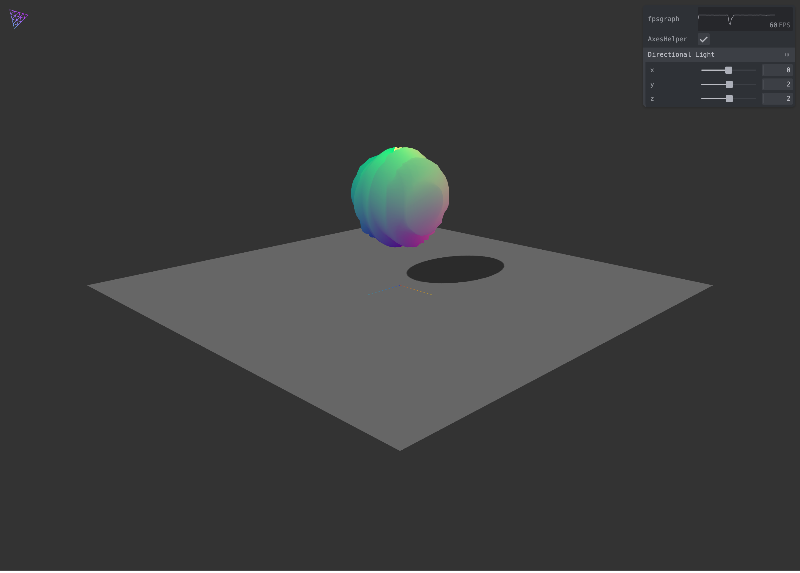

# Modern ThreeJS ⚡️

> Modern ThreeJS boilerplate powered by Vite & Typescript.



Live demo [here](https://modern-three.alvarosaburido.dev/)

## Features

- Powered with [Vite](https://vite.dev/) 📦
- GUI controls using [Tweakpane](https://cocopon.github.io/tweakpane/) 🎛
- Typescript 🦾
- No classes, just functions 🎯
- Shader support (glsl) with[vite-plugin-glsl](https://github.com/UstymUkhman/vite-plugin-glsl) 🎨

## You can help me keep working on this project 💚

- [Become a Sponsor on GitHub](https://github.com/sponsors/alvarosabu)
- [One-time donation via PayPal](https://paypal.me/alvarosaburido)

## Check it out

You can create a repo with this template [here](https://github.com/alvarosabu/modern-three/generate)

Or if you prefer to do it manually with the cleaner git history

```bash
npx degit alvarosabu/modern-three my-awesome-three
cd my-awesome-three
pnpm i # If you don't have pnpm installed, run: npm install -g pnpm
```

### Project setup

### Use it

```
pnpm dev
```

This will serve the app at [http://localhost:3000](http://localhost:3000)

### Build it

```
pnpm build
```

Builds the app for production to the `dist` folder.<br>

The build is minified and the filenames include the hashes.<br>
Your app is ready to be deployed!

See the section about [deployment](#deployment) for more information.


